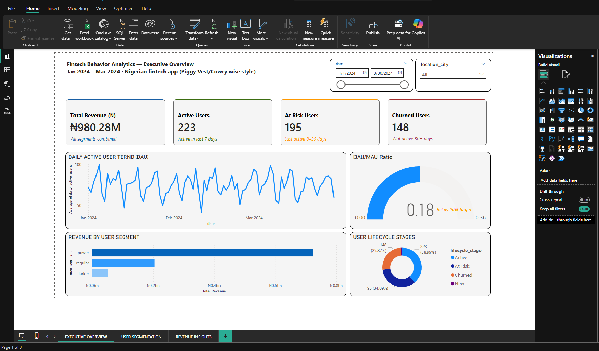
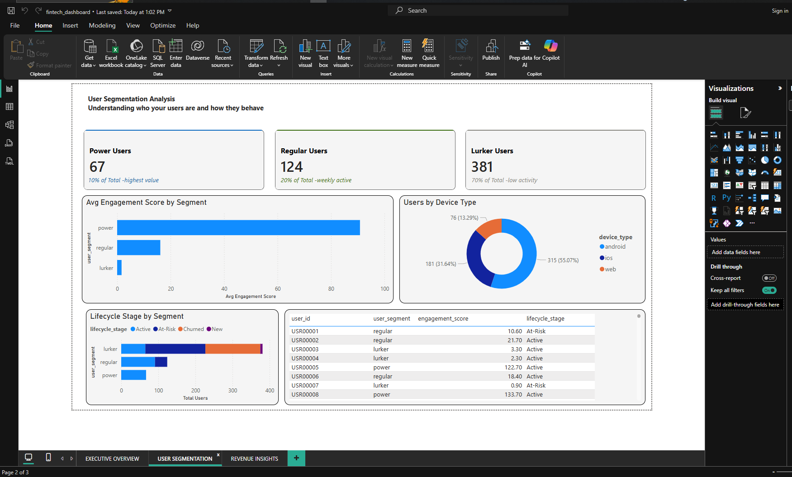
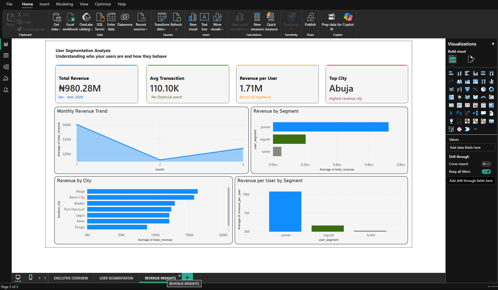

# Real-Time Customer Behavior Analytics Platform

## Project Overview
A three-layer analytics system tracking customer behavior for a Nigerian fintech app (PiggyVest/Cowrywise style). Built to demonstrate production-grade data engineering and analytics skills.

## Architecture
[Python Event Generator] -> [AWS S3 Data Lake] -> [Power BI Dashboard]
                                                          |
                                            [Automated Insight Generator]
                                                          |
                                                [Slack Daily Alerts]

## Key Metrics Tracked
- Daily Active Users (DAU) and Monthly Active Users (MAU)
- DAU/MAU ratio (engagement health metric)
- User lifecycle stages (New -> Active -> At-Risk -> Churned)
- Revenue per user segment
- Engagement score per user

## Tech Stack
| Tool | Purpose |
|------|---------|
| Python | Data generation and processing |
| Pandas | Data cleaning and transformation |
| DuckDB | Fast SQL analytics on Parquet files |
| PyArrow | Parquet file format (production standard) |
| AWS S3 | Cloud data lake storage |
| Boto3 | AWS Python SDK |
| Power BI | Interactive dashboard (3 pages) |
| Slack API | Automated daily insight delivery |

## Project Structure
fintech-behavior-analytics/
├── data/
│   ├── raw/         <- partitioned parquet files (year/month/day)
│   └── processed/  <- cleaned summary files
├── dashboards/
│   └── fintech_dashboard.pbix
├── reports/         <- daily insight text reports
├── docs/            <- documentation
├── fintech_analytics.ipynb
├── requirements.txt
└── .env.example

## Key Results
- Generated 50,000 realistic fintech user events over 90 days
- Built partitioned data lake on AWS S3 (eu-north-1)
- Identified 3 user segments: power (10%), regular (20%), lurker (70%)
- Power users generate 60% of total revenue despite being only 10% of users
- Automated daily Slack reports with churn risk and revenue alerts
- DAU/MAU ratio of 18% identified — below 20% healthy threshold

## Setup Instructions

### 1. Clone the Repository
git clone https://github.com/YOUR_USERNAME/fintech-behavior-analytics.git
cd fintech-behavior-analytics

### 2. Install Dependencies
pip install -r requirements.txt

### 3. Configure Environment Variables
Create a .env file and fill in these values:
AWS_ACCESS_KEY_ID=your_key
AWS_SECRET_ACCESS_KEY=your_secret
AWS_BUCKET_NAME=your_bucket
AWS_REGION=eu-north-1
SLACK_WEBHOOK_URL=your_webhook_url

### 4. Run the Notebook
Open fintech_analytics.ipynb in VS Code and run all cells top to bottom.

## Dashboard Pages
- Page 1 Executive Overview: DAU trend, DAU/MAU gauge, 4 KPI cards, lifecycle donut chart
- Page 2 User Segmentation: Engagement scores, device usage, lifecycle by segment, top users table
- Page 3 Revenue Insights: Monthly revenue trend, revenue by city, revenue per user segment

## Dashboard Screenshots

### Page 1 — Executive Overview

### Page 2 — User Segmentation

### Page 3 — Revenue Insights

## Business Insights Discovered
1. Power users (10%) drive 60% of revenue — retention is the highest priority
2. DAU/MAU ratio of 18% is below the 20% healthy engagement threshold
3. Lagos is the highest revenue generating city
4. 70% of users are lurkers — large untapped engagement opportunity
5. Engagement gap of 20+ points between power users and lurkers

## Automated Pipeline Steps
1. Extract raw events from AWS S3
2. Calculate DAU, MAU and engagement scores using DuckDB
3. Classify users into lifecycle stages (New, Active, At-Risk, Churned)
4. Generate plain English insight report
5. Save report to AWS S3 reports folder
6. Send formatted report to Slack data-insights channel every morning

## Author
Muhammad Umar Abubakar (Mohimpact) Department of Agric and Environmental Engineerimg, Bayero University Kano.

## License
MIT License